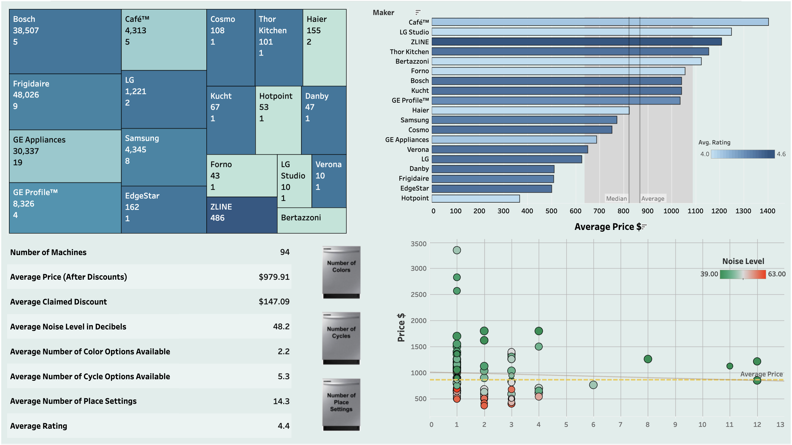

# Dishwasher Hunt

## Purpose: 
Finding a new dishwasher can be a daunting task. The purpose of this project is to use webscraping to compare dishwashers on Wayfair in order to discover key factors in what makes a top rated machine and trends in the different brands. 

________________________________________________________________________________________

## Methodology:

Python packages Splinter and BeautifulSoup were used to web scrape a Wayfair page displaying diswashers and their details. 

A function was written in Python to parse through the page, store, and clean desirable information. The information was stored in separate dictionaries: one for each machine. The desired information included:
  * maker
  * size
  * noise level in decibels
  * number of colors available
  * number of place settings 
  * number of cycles
  * price
  * original price (before discount)
  * rating (between 1 and 5)
  * number of rating

Then additional cleaning and calculations were performed such as the calculation of the discount, if present, for each machine. 

The data was converted into a Pandas DataFrame and loaded as a CSV file. 

The data was loaded into Tableau and explored via the production of charts. A dashboard was created to summarize findings.

The brands that recieved a total of less than 5 reviews were filtered out, including a luxury brand: He

________________________________________________________________________________________

## Results:

* Click on a brand to see it's stats! 
* Click on a dishwasher to change the feature to compare with the prices! 

________________________________________________________________________________________

## Analysis:

* The number of cycles available for a machine had a positive correlation with the price of the machine. 
* The noise level is also associated with the price with a positive correlation to a threshold price. Few dishwashers with noise levels greater than 50 Db are in the upper 50% of prices. The minimum noise level is 39 dB and the maximum is 63 dB. 
* The brands that had the most models available tend to have the highest number of ratings, with one major exception: ZLine. ZLine models also have the highest average rating of 4.6. This indicates that despite not being as popular of a brand, ZLine has a deal with Wayfair to gain exposure. This high degree of exposure may also have failed to garner the brand popularity. 
* The brand Bosch stands out for having a median number of models available, but having the highest number of ratings and the second highest average rating of 4.5. This indicates that the Bosch models available are highly popular and have garnered positive attention. 
* The median price is $823 and the average price is $868 indicating a fairly symmetrical distribution (it is not highly skewed). 

________________________________________________________________________________________

## Conclusion:

### On a budget: 

Look at a Frigidaire model.

Frigidaire has a relatively high average rating of 4.4, has several models to choose from, the highest number of ratings indicating strong popularity and loyalty, and is one of the most affordable brands. 

### Top Choice: 
Top choice is a Bosche model. 

Bosche has the highest average rating, a reasonable number of models to choose from, a high number of ratings indicating its popularity and loyalty, and is moderately priced. 
